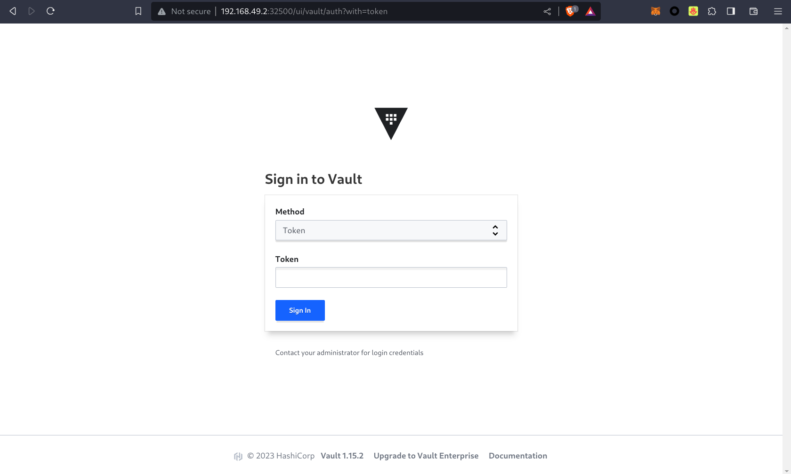
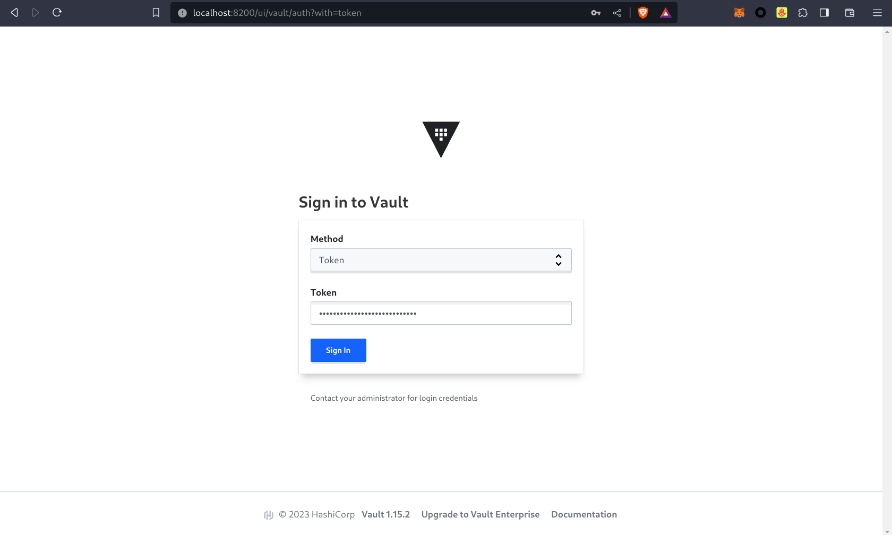
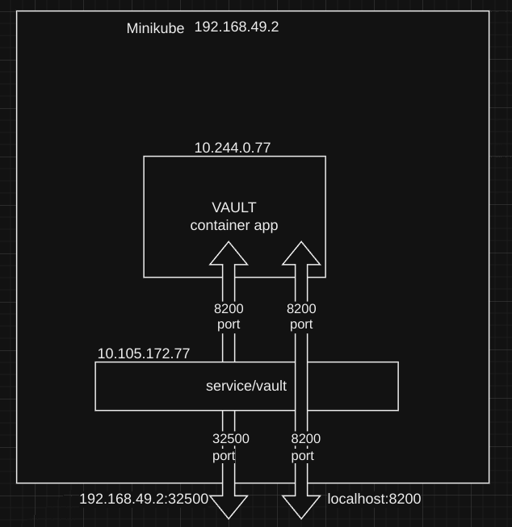

```
University: [ITMO University](https://itmo.ru/ru/)
Faculty: [FICT](https://fict.itmo.ru)
Course: [Introduction to distributed technologies](https://github.com/itmo-ict-faculty/introduction-to-distributed-technologies)
Year: 2023/2024
Group: K4113c
Author: Karaulov Andrey Olegovich
Lab: Lab1
Date of create: 27.11.2023
Date of finished: 30.11.2023
```

```console
sudo systemctl start docker
```
```console
minikube start --driver=docker
```

После того как мы запустили minicube, создадим манифест

```yaml
apiVersion: v1
kind: Pod
metadata:
  name: "vault"
  namespace: default
  labels:
    app: "vault"
spec:
  containers:
  - name: vault
    image: hashicorp/vault
    ports:
    - containerPort:  8200
```

`kind` - тут мы указываем, что создаем POD

`image` - указываем какой docker image хотим взять (в данном случае скачиваем image из docker hub)

`containerPort` - мы указываем какой порт хотим пробросить. 

Теперь нам необходимо создать pod
```console
kubectl apply -f vault.yaml
```
```console
➜  ~ kubectl get pods -o wide
NAME    READY   STATUS    RESTARTS   AGE   IP            NODE       NOMINATED NODE   READINESS GATES
vault   1/1     Running   0          22m   10.244.0.77   minikube   <none>           <none>
```
Наш под с контейнером Vault поднялся

Теперь нам необходимо создать service 
```
kubectl expose pod vault --type=NodePort --port=8200
```
Эта команда создает новый сервис типа NodePort. Он служит для того, чтобы предоставлять доступ подам во внешний мир. Он сопоставляет порт пода порту ноды из промежутка 30000-32767

```console
➜  lab1 git:(main) ✗ kubectl get services
NAME         TYPE        CLUSTER-IP      EXTERNAL-IP   PORT(S)          AGE
kubernetes   ClusterIP   10.96.0.1       <none>        443/TCP          13m
vault        NodePort    10.105.172.77   <none>        8200:32500/TCP   2m21s
```
Мы видим, что наш под будет доступен на порту 32500. Теперь можно проверить, что приложение доступно вне кластера, с помощью curl, IP-адреса узла и порта, проброшенного вовне:
```console
➜  ~ minikube ip
192.168.49.2
```


Теперь прокинем порт на нашу машину
```
➜  lab1 git:(main) ✗ kubectl port-forward services/vault 8200:8200
Forwarding from 127.0.0.1:8200 -> 8200
Forwarding from [::1]:8200 -> 8200
```

Теперь можем перейти на localhost:8200


Зайдем в логи пода и найдем ключ
```console
➜  ~ kubectl logs vault 
Couldn't start vault with IPC_LOCK. Disabling IPC_LOCK, please use --cap-add IPC_LOCK
==> Vault server configuration:

Administrative Namespace: 
             Api Address: http://0.0.0.0:8200
                     Cgo: disabled
         Cluster Address: https://0.0.0.0:8201
   Environment Variables: GODEBUG, HOME, HOSTNAME, KUBERNETES_PORT, KUBERNETES_PORT_443_TCP, KUBERNETES_PORT_443_TCP_ADDR, KUBERNETES_PORT_443_TCP_PORT, KUBERNETES_PORT_443_TCP_PROTO, KUBERNETES_SERVICE_HOST, KUBERNETES_SERVICE_PORT, KUBERNETES_SERVICE_PORT_HTTPS, NAME, PATH, PWD, SHLVL, VERSION
              Go Version: go1.21.3
              Listener 1: tcp (addr: "0.0.0.0:8200", cluster address: "0.0.0.0:8201", max_request_duration: "1m30s", max_request_size: "33554432", tls: "disabled")
               Log Level: 
                   Mlock: supported: true, enabled: false
           Recovery Mode: false
                 Storage: inmem
                 Version: Vault v1.15.2, built 2023-11-06T11:33:28Z
             Version Sha: cf1b5cafa047bc8e4a3f93444fcb4011593b92cb

==> Vault server started! Log data will stream in below:
...

The unseal key and root token are displayed below in case you want to
seal/unseal the Vault or re-authenticate.

Unseal Key: 9qIQzh41P7dRZlQhcJCSrcDVCzCG+GrTb3ATIItFcCQ=
Root Token: hvs.trzLlyjASDhBvRSEuIfab93L

Development mode should NOT be used in production installations!
```

Берем токен **Root Token: hvs.trzLlyjASDhBvRSEuIfab93L** и заходим в vault


