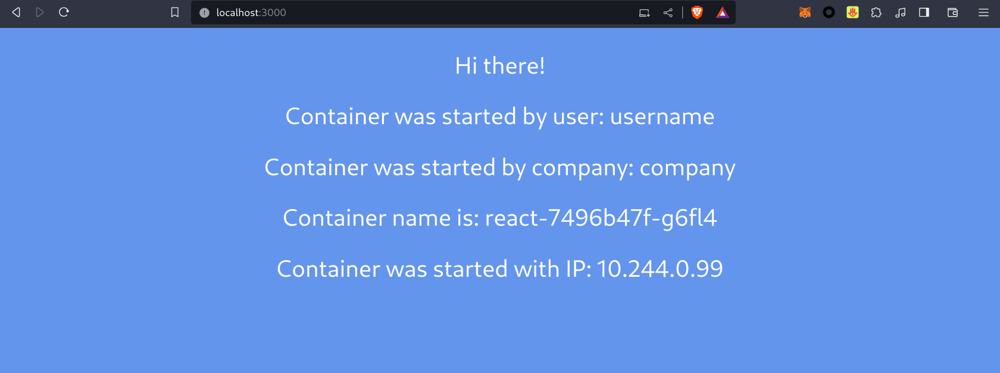
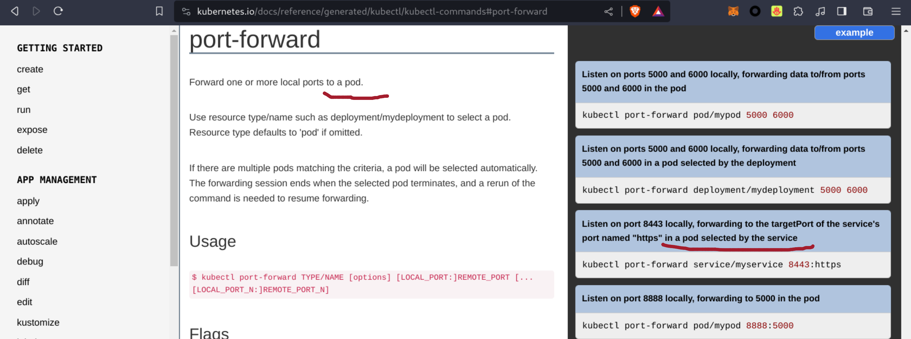
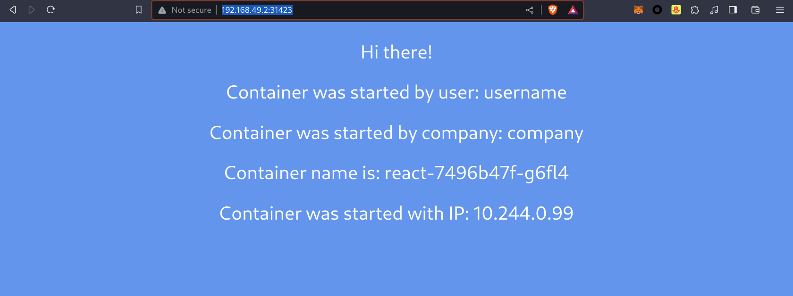
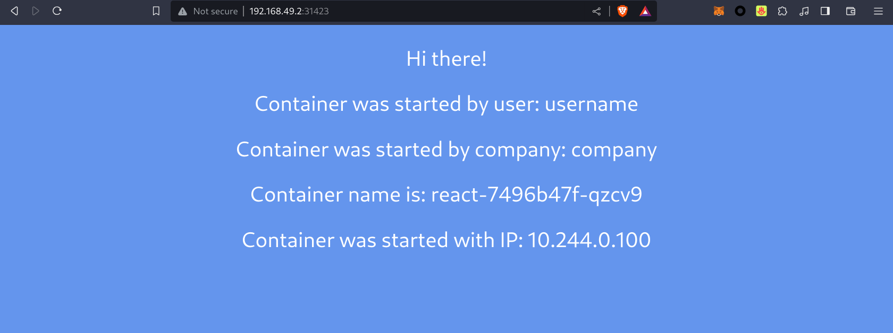
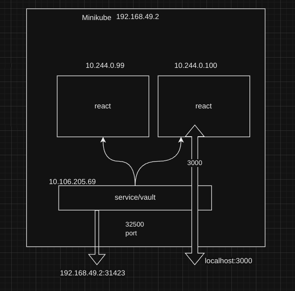

```
University: [ITMO University](https://itmo.ru/ru/)
Faculty: [FICT](https://fict.itmo.ru)
Course: [Introduction to distributed technologies](https://github.com/itmo-ict-faculty/introduction-to-distributed-technologies)
Year: 2023/2024
Group: K4113c
Author: Karaulov Andrey Olegovich
Lab: Lab2
Date of create: 28.11.2023
Date of finished: 30.11.2023
```

1) Вам необходимо создать deployment с 2 репликами контейнера ifilyaninitmo/itdt-contained-frontend:master и передать переменные в эти реплики: REACT_APP_USERNAME, REACT_APP_COMPANY_NAME.

```yaml
apiVersion: apps/v1
kind: Deployment
metadata:
  name: react
  labels:
    app: react
spec:
  replicas: 2
  selector:
    matchLabels:
      app: react
  template:
    metadata:
      labels:
        app: react
    spec:
      containers:
      - name: react
        image: ifilyaninitmo/itdt-contained-frontend:master
        ports:
        - containerPort: 3000
        env:
        - name: REACT_APP_USERNAME
          value: "username"
        - name: REACT_APP_COMPANY_NAME
          value: "company"
```
Создадим описанный deployment
```console
➜  lab2 git:(main) ✗ kubectl apply -f react_app.yaml
deployment.apps/react created
```
2) Создать сервис через который у вас будет доступ на эти "поды". Выбор типа сервиса остается на ваше усмотрение.

```console
➜  lab2 git:(main) ✗ kubectl expose deployment react --type=NodePort --port=3000
service/react exposed
➜  lab2 git:(main) ✗ kubectl get po,svc,ep -l app=react
NAME                       READY   STATUS    RESTARTS   AGE
pod/react-7496b47f-g6fl4   1/1     Running   0          10s
pod/react-7496b47f-qzcv9   1/1     Running   0          10s

NAME            TYPE       CLUSTER-IP      EXTERNAL-IP   PORT(S)          AGE
service/react   NodePort   10.106.205.69   <none>        3000:31423/TCP   62s

NAME              ENDPOINTS                            AGE
endpoints/react   10.244.0.100:3000,10.244.0.99:3000   62s

```

3) Запустить в minikube режим проброса портов и подключитесь к вашим контейнерам через веб браузер.

```console
➜  lab2 git:(main) ✗ kubectl port-forward services/react 3000:3000  
Forwarding from 127.0.0.1:3000 -> 3000
Forwarding from [::1]:3000 -> 3000
```
Перейдем на localhost:3000



Проверьте на странице в веб браузере переменные REACT_APP_USERNAME, REACT_APP_COMPANY_NAME и Container name. Изменяются ли они? Если да то почему?

`username` и `company` были определены в react_app.yaml, поэтому они не изменяются.

`container name` и `container ip` также не будут меняться потому что NodePort пробрасывает порт непосредственно к поду



Чтобы посмотреть load balancer в деле, необходимо обращаться к сервису (http://192.168.49.2:31423/)




Проверьте логи контейнеров, приложите логи в отчёт.

```console
➜  lab2 git:(main) ✗ kubectl logs pods/react-7496b47f-g6fl4 
Builing frontend
Browserslist: caniuse-lite is outdated. Please run:
  npx update-browserslist-db@latest
  Why you should do it regularly: https://github.com/browserslist/update-db#readme
Browserslist: caniuse-lite is outdated. Please run:
  npx update-browserslist-db@latest
  Why you should do it regularly: https://github.com/browserslist/update-db#readme
build finished
Server started on port 3000
```
```console
➜  lab2 git:(main) ✗ kubectl logs pods/react-7496b47f-qzcv9 
Builing frontend
Browserslist: caniuse-lite is outdated. Please run:
  npx update-browserslist-db@latest
  Why you should do it regularly: https://github.com/browserslist/update-db#readme
Browserslist: caniuse-lite is outdated. Please run:
  npx update-browserslist-db@latest
  Why you should do it regularly: https://github.com/browserslist/update-db#readme
build finished
Server started on port 3000

```

