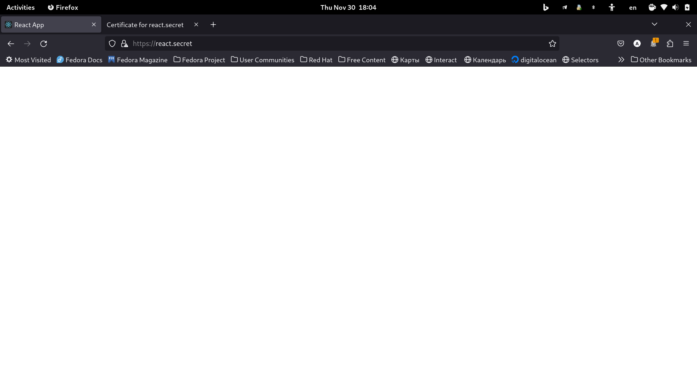
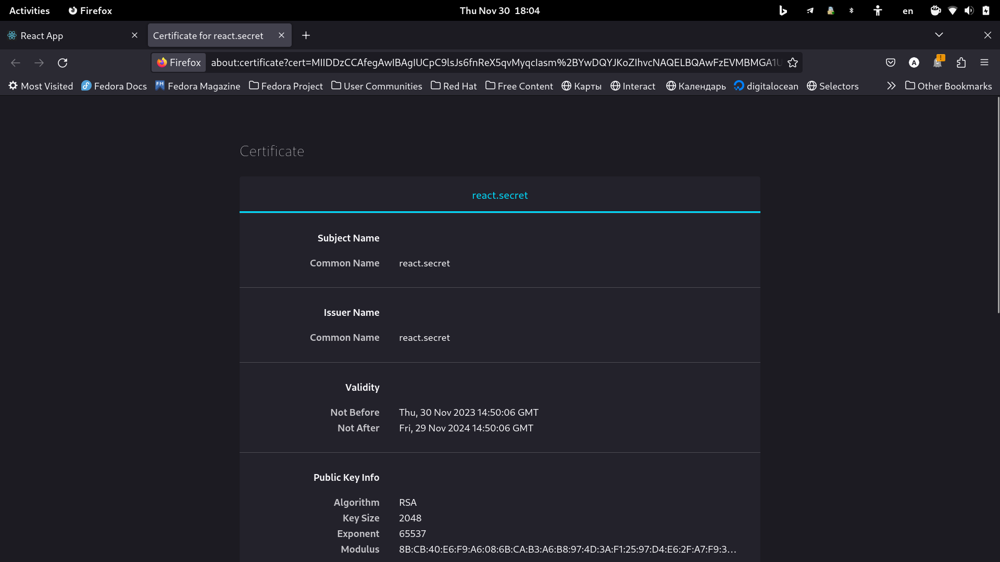
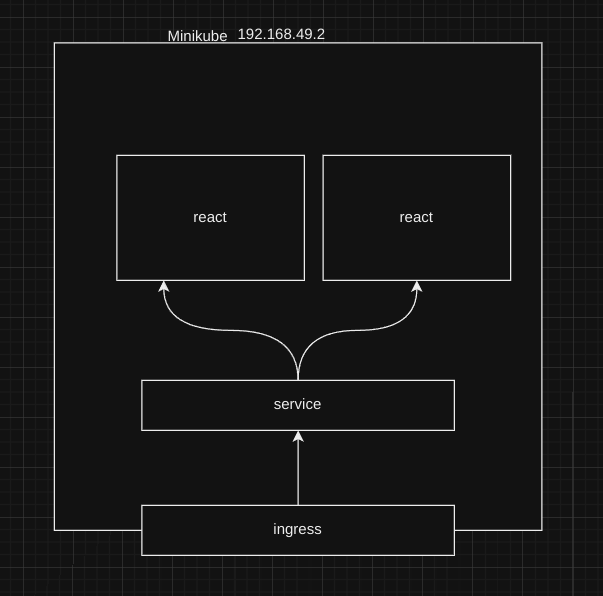

```
University: [ITMO University](https://itmo.ru/ru/)
Faculty: [FICT](https://fict.itmo.ru)
Course: [Introduction to distributed technologies](https://github.com/itmo-ict-faculty/introduction-to-distributed-technologies)
Year: 2023/2024
Group: K4113c
Author: Karaulov Andrey Olegovich
Lab: Lab3
Date of create: 29.11.2023
Date of finished: 30.11.2023
```
---
1) Вам необходимо создать configMap с переменными: REACT_APP_USERNAME, REACT_APP_COMPANY_NAME.

```yaml
apiVersion: v1
kind: ConfigMap
metadata:
  name: react-app-variables
data:
  REACT_APP_USERNAME: "username"
  REACT_APP_COMPANY_NAME: "company"
```
---
2) Вам необходимо создать replicaSet с 2 репликами контейнера ifilyaninitmo/itdt-contained-frontend:master и используя ранее созданный configMap передать переменные REACT_APP_USERNAME, REACT_APP_COMPANY_NAME

```yaml
apiVersion: apps/v1
kind: ReplicaSet
metadata:
  name: react
  labels:
    app: react
spec:
  replicas: 2
  selector:
    matchLabels:
      app: react
  template:
    metadata:
      labels:
        app: react
    spec:
      containers:
        - name: react
          image: ifilyaninitmo/itdt-contained-frontend:master
          ports:
            - containerPort: 3000
          env:
            - name: REACT_APP_USERNAME
              valueFrom:
                configMapKeyRef:
                  name: react-app-variables
                  key: REACT_APP_USERNAME
            - name: REACT_APP_COMPANY_NAME
              valueFrom:
                configMapKeyRef:
                  name: react-app-variables
                  key: REACT_APP_COMPANY_NAME

```
Запустми наш replicaset и созданим для него service
```console
➜  lab3 git:(main) ✗ kubectl apply -f react.yaml 
configmap/react-app-variables created
replicaset.apps/react created
➜  lab3 git:(main) ✗ kubectl expose replicaset react --type=NodePort --port=3000                                              
service/react exposed

```

---
3) Включить minikube addons enable ingress и сгенерировать TLS сертификат, импортировать сертификат в minikube.

Включаем ingress
```console
➜  lab3 git:(main) ✗ minikube addons enable ingress
💡  ingress is an addon maintained by Kubernetes. For any concerns contact minikube on GitHub.
You can view the list of minikube maintainers at: https://github.com/kubernetes/minikube/blob/master/OWNERS
    ▪ Using image registry.k8s.io/ingress-nginx/controller:v1.8.1
    ▪ Using image registry.k8s.io/ingress-nginx/kube-webhook-certgen:v20230407
    ▪ Using image registry.k8s.io/ingress-nginx/kube-webhook-certgen:v20230407
🔎  Verifying ingress addon...
🌟  The 'ingress' addon is enabled
```

Генерируем самоподписанный сертификат
```console
➜  lab3 git:(main) ✗ openssl req -x509 -nodes -days 365 -newkey rsa:2048 -keyout tls.key -out tls.crt -subj "/CN=react.secret"
```
`req`: Указывает, что команда OpenSSL должна работать с запросами на сертификаты.

`-x509`: Этот флаг указывает, что должен быть создан самоподписанный сертификат, а не запрос на сертификат.

`-nodes`: Этот флаг указывает, что закрытый ключ не должен быть зашифрован паролем. Если вы опустите этот флаг, вас попросят ввести пароль для закрытого ключа.

`-days 365`: Этот флаг устанавливает срок действия сертификата в 365 дней. Вы можете изменить это значение в соответствии с вашими требованиями.

`-newkey rsa:2048`: Этот флаг указывает, что должен быть сгенерирован новый закрытый ключ RSA длиной 2048 бит.

`-keyout tls.key`: Этот флаг указывает файл, в который должен быть сохранен сгенерированный закрытый ключ. В вашем случае это файл с именем tls.key.

`-out tls.crt`: Этот флаг указывает файл, в который должен быть сохранен сгенерированный сертификат. В вашем случае это файл с именем tls.crt.

`-subj "/CN=react.secret"`: Этот флаг позволяет указать субъект (отличительное имя) для сертификата. /CN=react.secret устанавливает атрибут Common Name (CN) сертификата в "react.secret". Обычно Common Name представляет полностью определенное доменное имя (FQDN) сервера.

Создаем kubectl secret
```console
➜  lab3 git:(main) ✗ kubectl create secret tls secret-tls --key="tls.key" --cert="tlscrt"
secret/secret-tls created
```
---
4) Создать ingress в minikube, где указан ранее импортированный сертификат, FQDN по которому вы будете заходить и имя сервиса который вы создали ранее.
```yaml
apiVersion: networking.k8s.io/v1
kind: Ingress
metadata:
  name: my-ingress
spec:
  tls:
  - hosts:
    - react.secret
    secretName: secret-tls
  rules:
  - host: react.secret
    http:
      paths:
      - path: /
        pathType: Prefix
        backend:
          service:
            name: react
            port:
              number: 3000
```

В `hosts` указываем наш CN

В `secretName` указываем наш tls secret

```console
➜  lab3 git:(main) ✗ kubectl apply -f ingress.yaml 
ingress.networking.k8s.io/my-ingress created
```

---
5) В hosts пропишите FQDN и IP адрес вашего ingress и попробуйте перейти в браузере по FQDN имени.


---
6) Войдите в веб приложение по вашему FQDN используя HTTPS и проверьте наличие сертификата.




