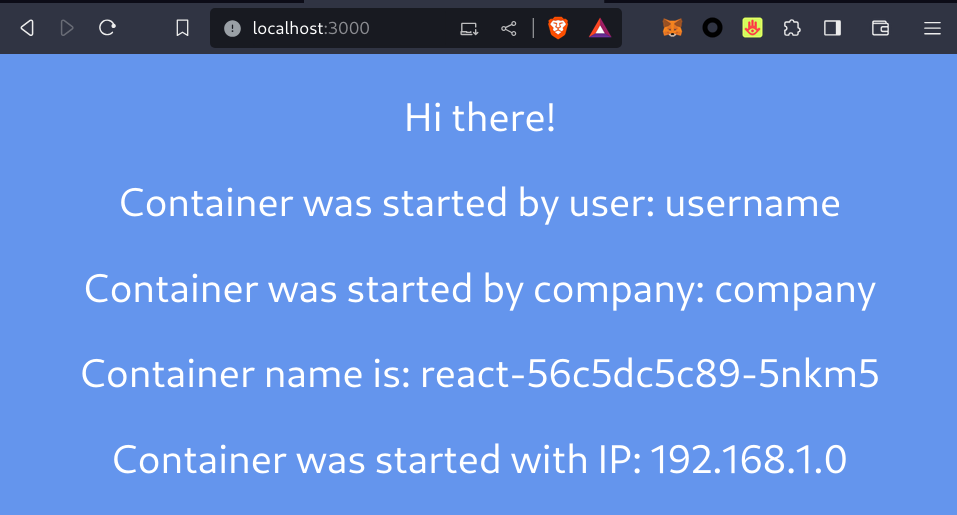
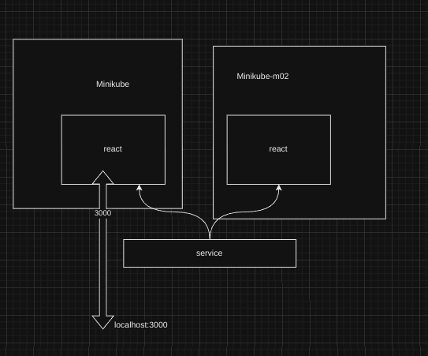

```
University: [ITMO University](https://itmo.ru/ru/)
Faculty: [FICT](https://fict.itmo.ru)
Course: [Introduction to distributed technologies](https://github.com/itmo-ict-faculty/introduction-to-distributed-technologies)
Year: 2023/2024
Group: K4113c
Author: Karaulov Andrey Olegovich
Lab: Lab4
Date of create: 05.12.2023
Date of finished: 07.12.2023
```
---
1) При запуске minikube установите плагин CNI=calico и режим работы Multi-Node Clusters одновеременно, в рамках данной лабораторной работы вам нужно развернуть 2 ноды.

```console
➜  ~ minikube start --driver=docker --nodes 2 --network-plugin=cni --cni=calico
😄  minikube v1.31.2 on Fedora 38
✨  Using the docker driver based on user configuration
❗  With --network-plugin=cni, you will need to provide your own CNI. See --cni flag as a user-friendly alternative
📌  Using Docker driver with root privileges
👍  Starting control plane node minikube in cluster minikube
🚜  Pulling base image ...
🔥  Creating docker container (CPUs=2, Memory=2200MB) ...
🐳  Preparing Kubernetes v1.27.4 on Docker 24.0.4 ...
    ▪ Generating certificates and keys ...
    ▪ Booting up control plane ...
    ▪ Configuring RBAC rules ...
🔗  Configuring Calico (Container Networking Interface) ...
    ▪ Using image gcr.io/k8s-minikube/storage-provisioner:v5
🔎  Verifying Kubernetes components...
🌟  Enabled addons: storage-provisioner, default-storageclass

👍  Starting worker node minikube-m02 in cluster minikube
🚜  Pulling base image ...
🔥  Creating docker container (CPUs=2, Memory=2200MB) ...
🌐  Found network options:
    ▪ NO_PROXY=192.168.49.2
🐳  Preparing Kubernetes v1.27.4 on Docker 24.0.4 ...
    ▪ env NO_PROXY=192.168.49.2
🔎  Verifying Kubernetes components...
🏄  Done! kubectl is now configured to use "minikube" cluster and "default" namespace by default
```
---
2) Проверьте работу CNI плагина Calico и количество нод, результаты проверки приложите в отчет.
```console
➜  ~ kubectl get pod -l k8s-app=calico-node -A
NAMESPACE     NAME                READY   STATUS    RESTARTS   AGE
kube-system   calico-node-45n87   1/1     Running   0          7m43s
kube-system   calico-node-tl8t6   1/1     Running   0          7m47s
```
```console
➜  ~ kubectl get nodes
NAME           STATUS   ROLES           AGE   VERSION
minikube       Ready    control-plane   30s   v1.27.4
minikube-m02   Ready    <none>          11s   v1.27.4
```
---
3) Для проверки работы Calico мы попробуем одну из функций под названием IPAM Plugin.
Для проверки режима IPAM необходимо для запущеных ранее нод указать label по признаку стойки или географического расположения (на ваш выбор).

```console
➜  ~ kubectl label nodes minikube workload=prod
node/minikube labeled
➜  ~ kubectl label nodes minikube-m02 workload=test
node/minikube-m02 labeled
```
```console
➜  ~ kubectl get nodes -L workload --show-labels
NAME           STATUS   ROLES           AGE     VERSION   WORKLOAD   LABELS
minikube       Ready    control-plane   6m43s   v1.27.4   prod       ...,workload=prod
minikube-m02   Ready    <none>          6m22s   v1.27.4   test       ...,workload=test
```
---
4) После этого вам необходимо разработать манифест для Calico который бы на основе ранее указанных меток назначал бы IP адреса "подам" исходя из пулов IP адресов которые вы указали в манифесте.

```yaml
apiVersion: projectcalico.org/v3
kind: IPPool
metadata:
  name: prod-ippool
spec:
  cidr: 192.168.0.0/24
  ipipMode: Always
  natOutgoing: true
  nodeSelector: workload == "prod"
---
apiVersion: projectcalico.org/v3
kind: IPPool
metadata:
  name: test-ippool
spec:
  cidr: 192.168.1.0/24
  ipipMode: Always
  natOutgoing: true
  nodeSelector: workload == "test"
```

```console
➜  lab4 git:(main) ✗ kubectl calico delete ippools default-ipv4-ippool --allow-version-mismatch

➜  lab4 git:(main) ✗ kubectl calico create -f calico.yaml --allow-version-mismatch
Successfully created 2 'IPPool' resource(s)

➜  lab4 git:(main) ✗ kubectl calico get ippools --allow-version-mismatch
NAME          CIDR             SELECTOR
prod-ippool   192.168.0.0/24   workload == "prod"
test-ippool   192.168.1.0/24   workload == "test"
```
---
5) Вам необходимо создать deployment с 2 репликами контейнера ifilyaninitmo/itdt-contained-frontend:master и передать переменные в эти реплики: REACT_APP_USERNAME, REACT_APP_COMPANY_NAME.

```yaml
apiVersion: v1
kind: ConfigMap
metadata:
  name: react-app-variables
data:
  REACT_APP_USERNAME: "username"
  REACT_APP_COMPANY_NAME: "company"
---
apiVersion: apps/v1
kind: Deployment
metadata:
  name: react
  labels:
    app: react
spec:
  replicas: 2
  selector:
    matchLabels:
      app: react
  template:
    metadata:
      labels:
        app: react
    spec:
      containers:
        - name: react
          image: ifilyaninitmo/itdt-contained-frontend:master
          ports:
            - containerPort: 3000
          env:
            - name: REACT_APP_USERNAME
              valueFrom:
                configMapKeyRef:
                  name: react-app-variables
                  key: REACT_APP_USERNAME
            - name: REACT_APP_COMPANY_NAME
              valueFrom:
                configMapKeyRef:
                  name: react-app-variables
                  key: REACT_APP_COMPANY_NAME
```

➜  lab4 git:(main) ✗ kubectl apply -f react.yaml
configmap/react-app-variables unchanged
deployment.apps/react created
---
6) Создать сервис через который у вас будет доступ на эти "поды". Выбор типа сервиса остается на ваше усмотрение.

```console
➜  ~ kubectl expose deployment react --type=NodePort --port=3000
```
---
7) Запустить в minikube режим проброса портов и подключитесь к вашим контейнерам через веб браузер.

```console
➜  lab4 git:(main) ✗ kubectl port-forward services/react 3000:3000           
Forwarding from 127.0.0.1:3000 -> 3000
Forwarding from [::1]:3000 -> 3000
```


---
8) Проверьте на странице в веб браузере переменные Container name и Container IP. Изменяются ли они? Если да то почему?
`container name` и `container ip` не будут меняться потому что NodePort пробрасывает порт непосредственно к поду
---
9) Используя kubectl exec зайдите в любой "под" и попробуйте попинговать "поды" используя FQDN имя соседенего "пода", результаты пингов необходимо приложить к отчету.
```console
➜  lab4 git:(main) ✗ kubectl get pods -o wide                                
NAME                     READY   STATUS    RESTARTS   AGE    IP             NODE           NOMINATED NODE   READINESS GATES
react-56c5dc5c89-5nkm5   1/1     Running   0          3m1s   192.168.1.0    minikube-m02   <none>           <none>
react-56c5dc5c89-jmhjl   1/1     Running   0          3m1s   192.168.0.65   minikube       <none>           <none>
➜  lab4 git:(main) ✗ kubectl exec react-56c5dc5c89-5nkm5 -- ping 192.168.0.65
PING 192.168.0.65 (192.168.0.65): 56 data bytes
64 bytes from 192.168.0.65: seq=0 ttl=62 time=0.203 ms
64 bytes from 192.168.0.65: seq=1 ttl=62 time=0.288 ms
64 bytes from 192.168.0.65: seq=2 ttl=62 time=0.300 ms
64 bytes from 192.168.0.65: seq=3 ttl=62 time=0.249 ms
64 bytes from 192.168.0.65: seq=4 ttl=62 time=0.221 ms
64 bytes from 192.168.0.65: seq=5 ttl=62 time=0.273 ms
```

